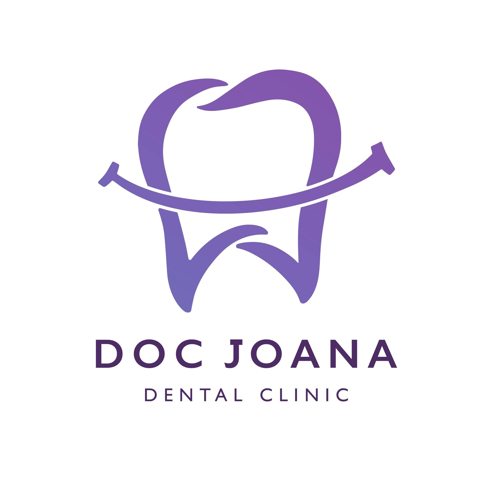

<!DOCTYPE html>
<html lang="en">
<head>
  <meta charset="UTF-8">
  <meta http-equiv="X-UA-Compatible" content="IE=edge">
  <meta name="viewport" content="width=device-width, initial-scale=1.0">
  <title> Joana Dental Clinic </title>
  <link rel="stylesheet" href="website.css">
  <link rel="stylesheet" href="https://cdnjs.cloudflare.com/ajax/libs/font-awesome/6.5.0/css/all.min.css">
</head>
<body>

  <nav class="navbar">
    
    <h1>Joana's Dental Clinic</h1>

    
&#9776;

    <ul class="nav-links" id="navLinks">
      <li><a href="#home"> Home </a></li>
      <li><a href="#about"> About Us </a></li>
      <li><a href="#services"> Services </a></li>
      <li><a href="#faqs"> FAQs </a></li>
      <li><a href="#contact"> Contact Us </a></li>
    </ul>
  </nav>

  <header id="home">
    

      <h2 class="slogan-heading"> Smile Brighter, Live Better </h2>
      <h1> A WONDERFUL SMILE </h1>
      <a href="#appointment" class="btn"> Book Appointment </a>
    

  </header>

  <section id="about" class="about-section">
    

      <h2 class="about-us-heading">About Us</h2>
      

        Joana Lyn Salunga, widely known as Dr. Joana Lyn, is the proud owner of Joana's Dental Clinic. She is a successful and driven individual who has established two branches of her clinic. Dr. Joana began her career and business journey in 2023, the year she opened her first clinic in Balibago, Angeles, Pampanga. Later, she expanded her practice by opening a second branch in Santa Cruz, Magalang, Pampanga.
          
        She studied dentistry at Centro Escolar University and pursued private studies to become a licensed dentist. Dr. Joana prefers to work independently, which inspired her to choose a career where she could be her own boss.
      

    

    

      

        
        Dr. Joana Lyn
      

    

  </section>

  <section class="clinic-overview">
    <h2>Our Clinic Facilities</h2>
    

      

        
        <h3>Dental Chair</h3>
        
This is where dental procedures are performed comfortably.

      

      

        
        <h3>Reception Area</h3>
        
Here is where patients check in and settle payments after their appointment.

      

      

        
        <h3>Certificates & Credentials</h3>
        
We proudly display our dentist's professional achievements and licenses.

      

    

  </section>

  <section id="clinic-location" class="about-section">
    

      <h2 class="clinic-location-heading">Clinic Location</h2>

      

        

          
          

            One of our branches is located in 
            <a href="https://maps.app.goo.gl/iRmh1uyqA99PKr2z6" target="_blank"><strong>Balibago, Angeles, Pampanga</strong></a>.
          

        

        

          
          

            The other branch is located in 
            <a href="https://maps.app.goo.gl/fiC7RPxtE6rMzrjK7" target="_blank"><strong>Magalang, Pampanga</strong></a>, on the 2nd floor near Chowking.
          

        

      

    

  </section>

  <section id="services" class="about-us-services">
    <h2>Services</h2>
    

      

        
        <h3 class="dental-services">Teeth Cleaning</h3>
        
Professional teeth cleaning to maintain oral health and prevent gum disease.

      

      

        
        <h3 class="dental-services">Filling (Pasta)</h3>
        
High-quality dental fillings to restore decayed or damaged teeth.

      

      

        
        <h3 class="dental-services">Veneers</h3>
        
Custom-made veneers to enhance the appearance of your smile.

      

      

        
        <h3 class="dental-services">Braces</h3>
        
Orthodontic solutions to align your teeth for a healthier bite and better aesthetics.

      

      

        
        <h3 class="dental-services">Teeth Whitening</h3>
        
Safe and effective treatments for a brighter, whiter smile.

      

    

  </section>

  <section id="faqs" class="about-faqs">
    <h2 class="faq-title">Frequently Asked Questions</h2>
    

      

        
What services do you offer?

        
We offer Teeth Cleaning, Filling (Pasta), Veneers, Braces, and Teeth Whitening.

      

      

        
Do I need to make an appointment before visiting?

        
No, we accept walk-ins.

      

      

        
Do you accept walk-ins?

        
Yes, we accept walk-ins depending on dentist availability, but appointments are prioritized.

      

      

        
What are your clinic hours?

        
Our clinic is open from 9:00 AM to 5:30 PM on Tuesday, Thursday, and Friday.

      

      

        
Where is your clinic located?

        
We have two branches: one in Balibago, Angeles, and another in Santa Cruz, Magalang.

      

      

        
What modes of payment does your clinic accept?

        
Our clinic accepts Cash, Bank Transfer, and mobile payments via GCash.

      

    

  </section>

  <footer id="contact">
    

      <h2>Contact Us</h2>
      
<i class="fas fa-map-marker-alt"></i> <strong>1st Branch:</strong> 1911 McArthur Highway, Balibago, Angeles City, Pampanga &nbsp;&nbsp;&nbsp;&nbsp;&nbsp;&nbsp;&nbsp;&nbsp;&nbsp;&nbsp;Almalel Bldg, 2nd Floor, Unit 5

      
<i class="fas fa-map-marker-alt"></i> <strong>2nd Branch:</strong> Marvea Subd, Sta. Cruz, Magalang, Pampanga, 2009

      
<i class="fas fa-map"></i> <strong>Service Areas:</strong> Dau · Cutud · Angeles City · Mabalacat · Magalang · San Fernando

      
<i class="fas fa-phone"></i> <strong>Mobile:</strong> <a href="tel:+639914221860">0991 422 1860</a>

      
<i class="fas fa-envelope"></i> <strong>Email:</strong> <a href="mailto:prosmilebydrjoana@gmail.com">prosmilebydrjoana@gmail.com</a>

      
<i class="fab fa-instagram"></i> <strong>Instagram:</strong> <a href="https://www.instagram.com/docjoanadental_clinic" target="_blank">@docjoanadental_clinic</a>

    

    

      
&copy; 2025 Joana's Dental Clinic. All rights reserved.

    

  </footer>

  

</body>
</html>

* {
  margin: 0;
  padding: 0;
  box-sizing: border-box;
}
html {
  scroll-behavior: smooth;
}
body {
  font-family: Arial, sans-serif;
  overflow-x: hidden;
}
.container {
  width: 100%;
  max-width: 1200px;
  margin: 0 auto;
  padding: 0 20px;
}
ul { list-style: none; }
a { text-decoration: none; color: inherit; }

.clinic-logo {
  position: sticky;
  top: 0;
  z-index: 10;
  width: 120px;             
  height: auto;
  border: 3px solid #3498db; 
  border-radius: 10px;       
  padding: 5px;              
  background-color: white;   
  box-shadow: 0 0 10px rgba(0, 0, 0, 0.1); 
  margin: 10px 20px 25px 10px;
}

.navbar {
  top: 0;
  left: 0;
  width: 100%;
  display: flex;
  align-items: center;
  justify-content: space-between;
  padding: 10px 20px;
  background-color: #2274a4;
  color: whitesmoke;
  z-index: 1000;
}
.nav-links {
  display: flex;
  margin-left: auto;
}
.nav-links li {
  margin: 0 15px;
}
.nav-links a {
  color: whitesmoke;
  font-weight: bold;
}

.hamburger {
  display: none;
  font-size: 28px;
  color: whitesmoke;
  cursor: pointer;
  margin-left: auto;
}

header {
  width: 100vw;
  height: 100vh;
  background: url(Joanafinal.jpg) bottom/cover no-repeat;
  display: flex;
  align-items: center;
  justify-content: center;
}
.header-content {
  text-align: center;
  color: whitesmoke;
  margin-bottom: 150px;
}
.slogan-heading {
  font-size: 3rem;
  position: relative;
  margin-bottom: 1.5rem;
}
.slogan-heading::after {
  content: "";
  position: absolute;
  left: 50%; transform: translateX(-50%);
  bottom: -10px;
  width: 140px; height: 4px;
  background: #e63946;
  transition: width 0.3s;
}
.slogan-heading:hover::after { width: 120px; }
.header-content h1 { font-size: 7vmin; margin: 50px 0 30px; }
.header-content h2 { font-size: 4vmin; margin-top: 150px; font-weight: bold; }
.ctn {
  display: inline-block;
  padding: 8px 15px;
  background: rgb(223,15,57);
  border-radius: 30px;
  color: whitesmoke;
}

section {
  padding: 60px 0;
  width: 100%;
}

.about-section {
  display: flex;
  flex-wrap: wrap;
  align-items: center;
  justify-content: center;
  gap: 20px;
  background: #fff;
  padding-top: 100px; 
}
.about-text, .about-image-container {
  flex: 1 1 300px;
  max-width: 600px;
  margin: 0 auto;
  border: 2px solid #ccc;
  padding: 15px;
  border-radius: 8px;
  background-color: #fdfdfd;
  margin-left: 20px; /* moves it slightly to the right */
  box-shadow: 2px 2px 8px rgba(0, 0, 0, 0.1); /* optional for soft effect */
  }
  
.about-text h2 {
  text-align: center;
  font-size: 2.5rem;
  margin-bottom: 1rem;
  position: relative;
}
.about-text h2::after {
  content: "";
  position: absolute;
  left: 50%; transform: translateX(-50%);
  bottom: -8px;
  width: 150px; height: 4px;
  background: #e63946;
}
.about-paragraph {
  border: 2px solid;
  padding: 1rem;
  background: #f7f7f7;
  border-left: 4px solid #c7d3ea;
  border-radius: 4px;
  line-height: 1.6;
  text-align: justify;
}
.about-image-container { display: flex; justify-content: center; }
.image-wrapper {
  position: relative;
  width: 100%;
  max-width: 300px;
  border-left: 4px solid #c7d3ea;
  border-radius: 8px;
  overflow: hidden;
  box-shadow: 0 4px 12px rgba(0,0,0,0.1);
}
.about-image { width: 100%; height: auto; object-fit: cover; }
.doctor-name {
  position: absolute;
  top: 10px; left: 10px;
  background: rgba(0,0,0,0.5);
  color: white; font-size: 16px; font-weight: bold;
  padding: 4px 8px; border-radius: 4px;
}

.image-wrapper:hover {
  transform: scale(1.05);
  transition: all 0.3s ease;
}
.image-wrapper:hover .about-image {
  filter: grayscale(100%);
}

.clinic-overview {
  text-align: center;
  background: #f4f7fb;
  border-top: 5px solid #6c8ebf;
  border-bottom: 5px solid #92aace;
}
.facility-gallery {
  display: flex;
  flex-wrap: wrap;
  justify-content: center;
  gap: 20px;
  margin-top: 20px;
}
.facility-item {
  background: white;
  border-radius: 12px;
  border: 3px solid transparent;
  border-image: linear-gradient(45deg,#92aace,#6c8ebf) 1;
  width: 260px;
  padding: 15px;
  text-align: center;
  transition: transform 0.3s ease;
}
.facility-item img { width: 100%; border-radius: 8px; }
.facility-item h3 { margin: 10px 0; font-size: 1.2rem; color: #3f5d8a; }
.facility-item p { font-size: .9rem; color: #444; }

.facility-item:hover {
  transform: translateY(-10px);
}
.facility-item:hover img {
  filter: brightness(70%);
}

.branch-container {
  display: flex;
  flex-wrap: wrap;
  justify-content: center;
  gap: 20px;
  margin-top: 20px;
}
.branch {
  background: #f9f9f9;
  padding: 15px;
  border-radius: 12px;
  box-shadow: 0 4px 10px rgba(0,0,0,0.1);
  max-width: 300px;
  text-align: center;
  transition: transform 0.3s ease;
}
.branch-image { width: 100%; border-radius: 8px; }
.branch p { margin-top: 10px; font-size: .9rem; line-height: 1.4; }

.branch:hover {
  transform: scale(1.05);
}

.services {
  text-align: center;
  background: #f9f9f9;
  padding: 40px 20px; 
}

.services h2 {
  font-size: 2rem;
  margin-bottom: 20px;
  color: #333;
  display: block;
  text-align: center;
}

.services-container {
  display: flex;
  flex-wrap: wrap;
  justify-content: center;
  gap: 20px;
}

.service-card {
  background: white;
  border-radius: 12px;
  box-shadow: 0 4px 10px rgba(0,0,0,0.15);
  padding: 15px;
  width: 260px;
  text-align: center;
  transition: transform 0.3s ease;
}
.service-card img { width: 100%; height: 140px; object-fit: cover; border-radius: 8px; }
.service-card h3 { margin: 10px 0; font-size: 1.2rem; color: #0077b6; }
.service-card p { font-size: .9rem; color: #555; }

.service-card:hover {
  transform: translateY(-10px);
}
.service-card:hover img {
  filter: brightness(80%);
}
.service-card:hover h3 {
  color: #e63946;
}
.service-card:hover p {
  color: #333;
}

.faq-section {
  padding: 40px 20px;
  background: #f0f8ff;
  font-family: 'Segoe UI', sans-serif;
}

.faq-title {
  text-align: center;
  font-size: 2rem;
  margin-bottom: 30px;
  color: #00557f;
}

.faq-grid {
  display: grid;
  grid-template-columns: repeat(auto-fit, minmax(280px, 1fr));
  gap: 20px;
  max-width: 1100px;
  margin: 0 auto;
}

.faq-item {
  background: #ffffff;
  border-radius: 15px;
  box-shadow: 0 4px 12px rgba(0, 85, 127, 0.2);
  padding: 20px;
  transition: transform 0.3s ease, box-shadow 0.3s ease;
  cursor: pointer;
  overflow: hidden;
  position: relative;
}

.faq-item:hover {
  transform: translateY(-5px);
  box-shadow: 0 8px 16px rgba(0, 85, 127, 0.3);
}

.faq-question {
  font-weight: bold;
  color: #003d5c;
  margin-bottom: 10px;
  font-size: 1.1rem;
}

.faq-answer {
  color: #333;
  font-size: 0.95rem;
  line-height: 1.5;
  transition: opacity 0.3s ease, max-height 0.3s ease;
}

footer {
  width: 100%;
  margin: 0;
  padding: 0;
  background-color: #1a1a1a;
  color: white;
  font-family: Arial, sans-serif;
}

.footer-content {
  padding: 30px 20px;
  max-width: 1000px;
  margin: 0 auto;
  text-align: center; /* Center all content */
}

.footer-content h2 {
  font-size: 24px;
  margin-bottom: 20px;
  border-bottom: 2px solid white;
  padding-bottom: 10px;
  display: inline-block;
}

.footer-content p {
  margin: 10px 0;
  font-size: 16px;
  line-height: 1.6;
}

.footer-content a {
  color: #4dd0e1;
  text-decoration: none;
}

.footer-content a:hover {
  text-decoration: underline;
}

.footer-bottom {
  text-align: center;
  padding: 15px;
  background-color: #111;
  font-size: 14px;
  border-top: 1px solid #333;
}

/* Responsive styles for smartphones */
@media (max-width: 600px) {
  .footer-content {
    padding: 20px 15px;
  }

  .footer-content h2 {
    font-size: 20px;
  }

  .footer-content p {
    font-size: 14px;
  }

  .footer-bottom {
    font-size: 13px;
    padding: 10px;
  }
}

body, html {
  margin: 0;
  padding: 0;
  overflow-x: hidden;
}

@media (max-width: 768px) {
  .hamburger { display: block; }
  .nav-links { display: none; flex-direction: column; position: absolute; top: 50px; right: 0; width: 180px; background: #333; padding: 10px 0; }
  .nav-links.active { display: flex; }
  .nav-links li { margin: 10px 20px; text-align: right; }
  .navbar h1 { font-size: 1.2rem; }

  /* ensure each section uses full width and is centered */
  .about-section, .clinic-overview, .branch-container, .services-container {
    padding: 20px 10px;
    margin: 0 auto;
  }
}
@media (max-width: 480px) {
  .services h2 { font-size: 1.5rem; }
  .service-card { width: 100%; max-width: 280px; }
}

